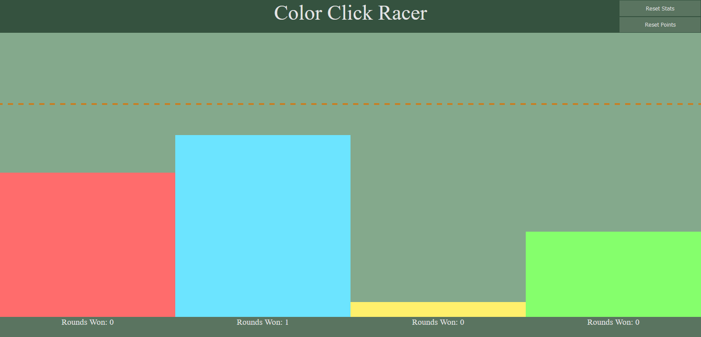

# Color Click Racer

Color click racer is an exercise in using websockets. It uses the Node ws library to create a simple server that tracks points for each 'team'. All clients to the server play in the same lobby.

## Running the application

The application currently isn't hosted, but can be ran through localhost by:

Running the server in `server`
```
npm install
```
```
node index.js
```


Running the client in web browser
```
client/index.html
```

Once running, the page should look like

